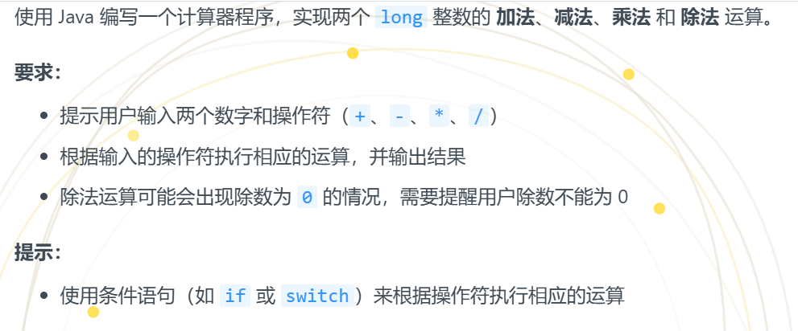
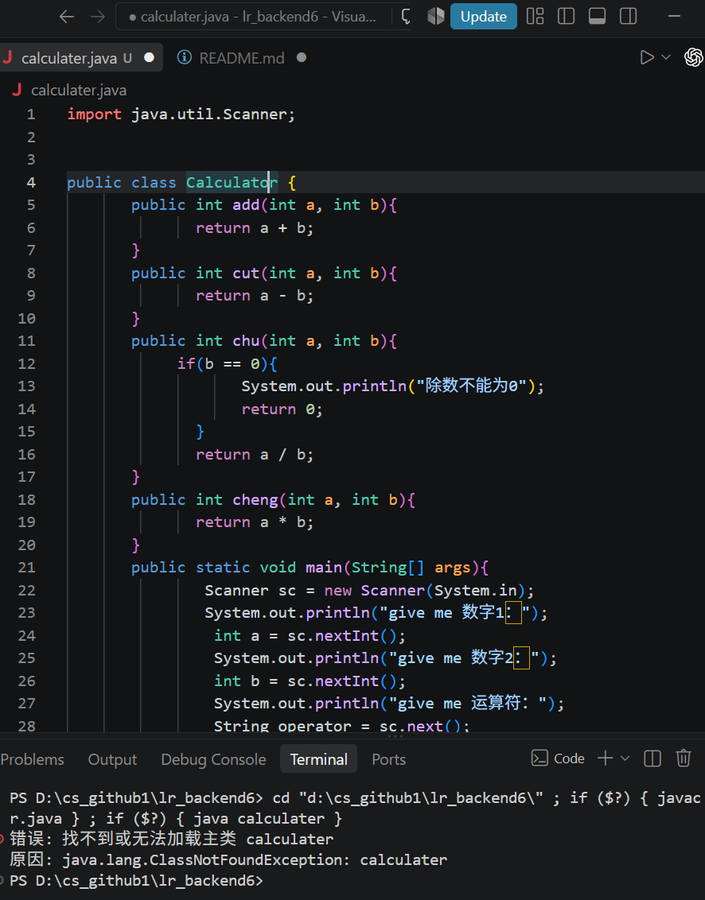
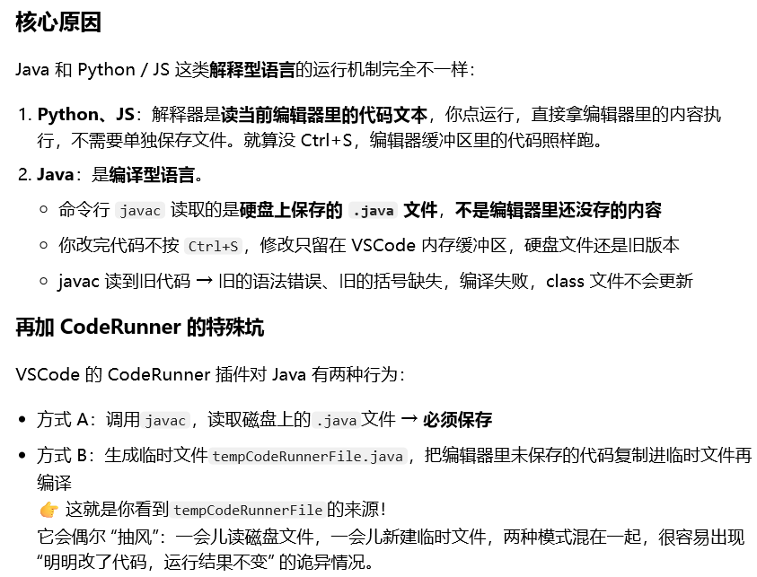
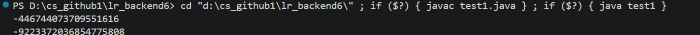
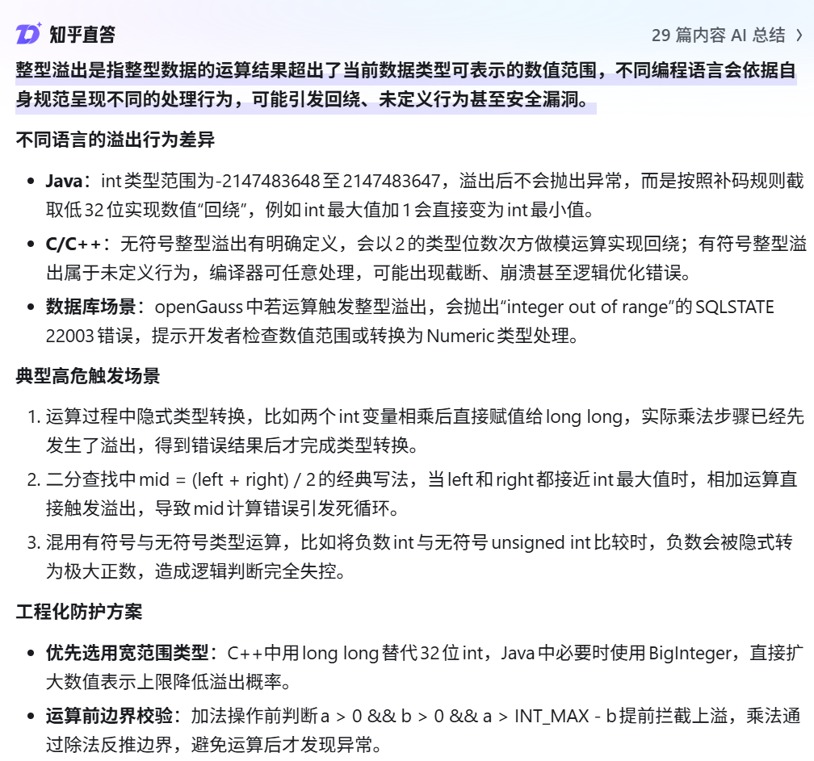
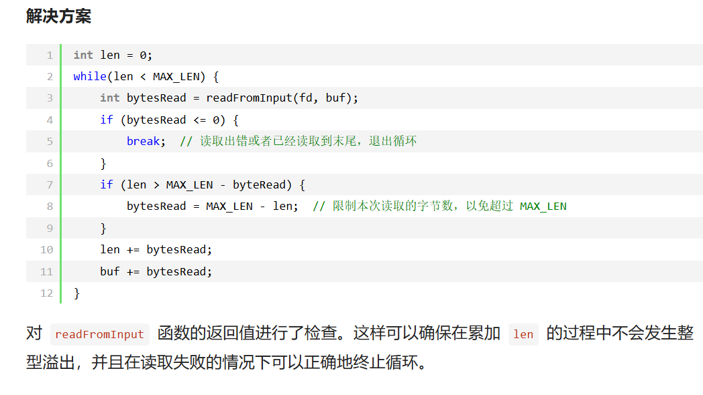
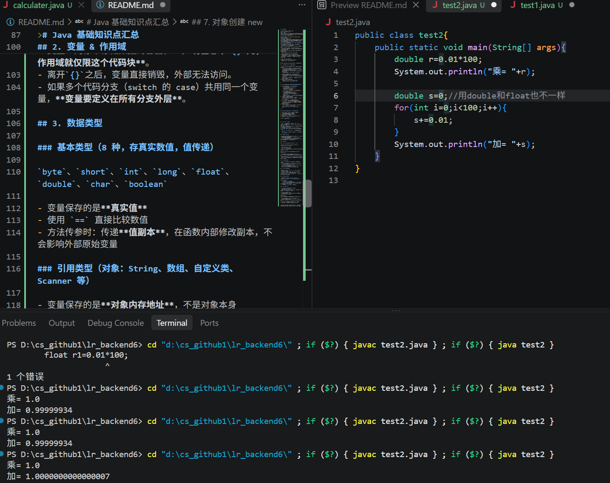

# lr_backend6

绿藻头是真的吗，是形状还是颜色

## 学习笔记
哎哟吓死我了刚打几个字突然就自动帮我补全整个了，我还以为只是类名，赶紧撤回。这个补全好奇怪，有时有有时没有，我写其他语言代码的时候也是

英语不好的人belike笑死我了，我说为啥运行不了，caculator拼错了

我在那试了好多遍代码都没办法编译，说没有找到主类，最后ls查看文件才发现是因为没有保存？？？？但是这个不是修改后默认这样了吗，难道还需要我ctrl+S手动保存吗

# 让豆包帮我总结了这次java的学习心得和遇到的问题，我自己也在看了一遍复盘一下
Java 新手踩坑总结（今日全部问题 + 核心知识点）
一、今天亲自踩过的所有坑（必记）
1. Java 必须手动保存才能运行（和 Python/JS 最大区别）
- 现象：改了代码、点运行完全没变化，报错依旧
- 原因：Java 是编译型语言，javac 只读取硬盘保存的文件，不读编辑器内存
- 对比：Python/JS 是解释型，点运行直接读编辑器内容，不用保存
- 解决：写完代码 Ctrl+S，或开启自动保存

2. 变量作用域问题（case 里定义变量报错）
- 错误写法：在单个 case 内部定义 int result
- 原理：变量只属于自己的 {} 代码块，出大括号直接销毁
- 正确做法：多个分支要用同一个变量，必须定义在switch 外面

3. 重复 new 对象浪费内存
- 错误：每个 case 都 new Calculator()
- 优化：只 new 一次对象，全程复用

---
## Java 新手踩坑总结（今日全部问题 + 核心知识点）

## 一、今天亲自踩过的所有坑（必记）

1. **Java 必须手动保存才能运行（和 Python/JS 最大区别）**
   - 现象：改了代码、点运行完全没变化，报错依旧
   - 原因：Java 是**编译型语言**，`javac` 只读取**硬盘保存的文件**，不读编辑器内存
   - 对比：Python/JS 是解释型，点运行直接读编辑器内容，不用保存
   - 解决：写完代码 `Ctrl+S`，或开启自动保存

2. **变量作用域问题（case 里定义变量报错）**
   - 错误写法：在单个 case 内部定义 `int result`
   - 原理：变量只属于自己的 `{}` 代码块，**出大括号直接销毁**
   - 正确做法：多个分支要用同一个变量，必须定义在 **switch 外面**
5. **重复 new 对象浪费内存**
   - 错误：每个 case 都 `new Calculator()`
   - 优化：**只 new 一次对象，全程复用**

---

## 二、今日最核心、最难懂的知识点（你纠结很久的）

1. **Java 两大数据类型本质（终极区分）**
   - 基本类型（8 种）
     - int、double、char、boolean 等
     - 变量里存的是**真实值**
     - 比较用 `==` 完全没问题
     - 传参是**值传递**：方法里修改，外面不会变
   - 引用类型（全部对象）
     - String、数组、自定义类、Scanner
     - 变量里存的是**地址，不是值**
     - **String 不能用 `==` 比内容！必须用 `.equals()`**
     - 数组、自定义对象传参：方法内改内容，外面会变
2. **Scanner 读取运算符的坑**
   - Scanner **没有 `nextChar()` 方法**
   - 想要读取单个运算符：先读 String，再 `.charAt(0)` 转 char
   - char 可以直接用 `==` 判断，超级方便
3. **为什么 int 传方法改不了？怎么才能改？**
   - 基本类型：传参是复制一份，**无法修改原变量**
   - 想要方法修改外面的数值：用 **数组 / 自定义类（引用类型）**
4. **Switch 分支规范**
   - 每个 case 必须加 `break`，**防止 case 穿透**
   - 必须加 `default` 处理非法输入
   - Java 支持 String 类型 switch，不用强行转 char

---

## 三、Java 新手固定编码习惯（以后不翻车）

1. 写 Java **必 `Ctrl+S` 保存**，再编译运行
2. 所有大括号**成对写**，再填代码
3. 变量尽量往外提，避免作用域不够用
4. 对象只 `new` 一次，重复复用
5. 字符串比较一律 `.equals()`，字符比较一律 `==`
6. Scanner 使用结束必须 `close()`

># Java 基础知识点汇总

## 1. Java 语言基础特性

- Java 属于**编译型语言**：源码 `.java` → 通过 `javac` 编译生成字节码 `.class`，再由 `java` 命令交给 JVM 执行。
- **`public` 修饰的类**：类名必须和文件名**完全相同（大小写、拼写一致）**。
- 程序入口：`public static void main(String[] args)`，这是 JVM 寻找的主方法，方法签名不能写错。
- 注释
  - `// 单行注释`：只作用当前一行，推荐新手优先使用。
  - `/* 块注释 */`：成对使用，可以跨多行，**不能单独写 `*/`**。

## 2. 变量 & 作用域

- 变量：内存中存储数据的容器，**声明在哪个`{}`内，作用域就仅限这个代码块**。
- 离开`{}`之后，变量直接销毁，外部无法访问。
- 如果多个代码分支（switch 的 case）共用同一个变量，**变量要定义在所有分支外层**。

## 3. 数据类型

### 基本类型（8 种，存真实数值，值传递）

`byte`、`short`、`int`、`long`、`float`、`double`、`char`、`boolean`

- 变量保存的是**真实值**
- 使用 `==` 直接比较数值
- 方法传参时：传递**值副本**，在函数内部修改副本，不会影响外部原始变量

### 引用类型（对象：String、数组、自定义类、Scanner 等）

- 变量保存的是**对象内存地址**，不是对象本身
- `==` 比较的是**地址是否相同**，**不能比较字符串内容**
- 字符串内容比较必须使用：`字符串A.equals(字符串B)`
- 方法传参：传递地址副本；通过地址修改对象内部数据，外部能看到变化

## 4. 方法（函数）

- 方法属于类，可以分为**实例方法**和**静态方法 static**
  1. **实例方法（没有 static）**：必须先`new`创建对象，通过对象调用 `对象.方法()`
  2. **static 静态方法**：属于类本身，直接 `类名.方法()` 调用，**不需要 new 对象**
- return：结束方法，并把结果返回给调用处。

## 5. switch 分支语句

- 支持类型：`byte` `short` `int` `char`，Java 7 及以上支持 `String`
- `case` 匹配成功后，**如果没有 break，会发生 case 穿透**，继续执行后面 case 代码
- 规范：每个 case 末尾加上`break`；增加`default`处理所有不匹配的非法情况

## 6. Scanner 输入类

- 需要先导包：`import java.util.Scanner;`
- 创建对象：`Scanner sc = new Scanner(System.in);`
- 常用读取方法
  - `sc.nextInt()`：读取整数
  - `sc.next()`：读取字符串（读到空格 / 换行停止）
- ⚠️ Scanner**没有 nextChar ()**，读取单个字符可以读字符串后 `str.charAt(0)`
- 使用完毕调用 `sc.close()` 关闭输入流

## 7. 对象创建 new

- `new 类名()`：在堆内存创建实例对象
- 实例方法调用依赖对象。
- 优化原则：**同一个对象尽量只 new 一次，重复复用，不要循环 / 多次分支反复 new**

## 8. 控制台输出 System.out.println ()

类比：
C++ `cout <<`
C `printf()`
Python `print()`
`System.out.println(内容);` 输出并换行；
`System.out.print(内容);` 输出**不换行**。

## 实验1

结果都是负数，没有报错和提示

哎哟原本想在知乎找有没有相关的文章，结果这些ai直接给出来了，文章没找到，但是这个总结写的挺好的

第一次用blog查东西，确实这里的专业的要多一些

总结一下吧：
1. 整形溢出是因为变量能保存的数值有上限，当计算结果超出这个最大的能存储范围，c好像会进行取模（%），而java会回卷，也就是减去能存储的最大的数字
解决方法是加一个判断或者你就用一个能存大点的数据类型呗

## 实验2
第一次时两个变量r和s都用的float，运行后终端提示第一个有问题，后修改r为double

查询后发现：
Java 里**直接写的小数字面量默认是 double 类型**

所以我不能这样声明，要用float的话需要转化类型

顺便修改一下s的类型看看有没有区别，然后发现答案不一样（哎呦，往后面看才发现题目刚好也让我改成double）
- float：32 位浮点数，**精度更低，误差更大**
- double：64 位浮点数，精度更高，误差更小

> 
> **不管 float 还是 double，底层都是二进制存储小数，都不能精确保存 0.01**，只是误差大小不一样。由图结果确实误差变小啦

- 查询后了解到语言有专门的十进制小数类型，底层不是二进制存储，运算慢一点但是比较准确吧，如果在精细的地方可能需要

//有一个问题就是类名不是说一般要大写吗，但是我每次文件命名都习惯小写，所以外面的那个类也是小写，但也没啥影响，可能只是不符合习惯吧

[github仓库](https://github.com/accelebratesky/lr_backend6.git)
[博客的整形溢出参考文章（虽然是讲c和c++的）](https://www.cnblogs.com/zangwhe/p/18097757)
[我和豆脚的弱智对话呜呜呜](https://www.doubao.com/thread/xCQgZrjb73BJhw3us)